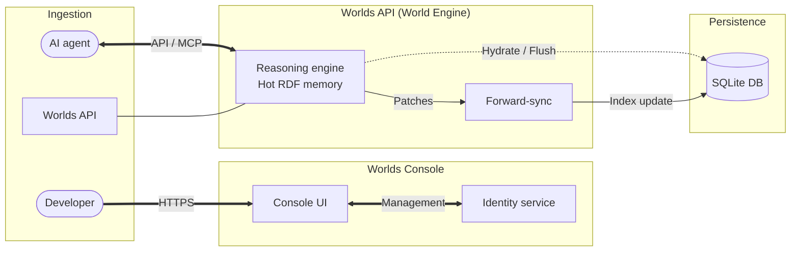
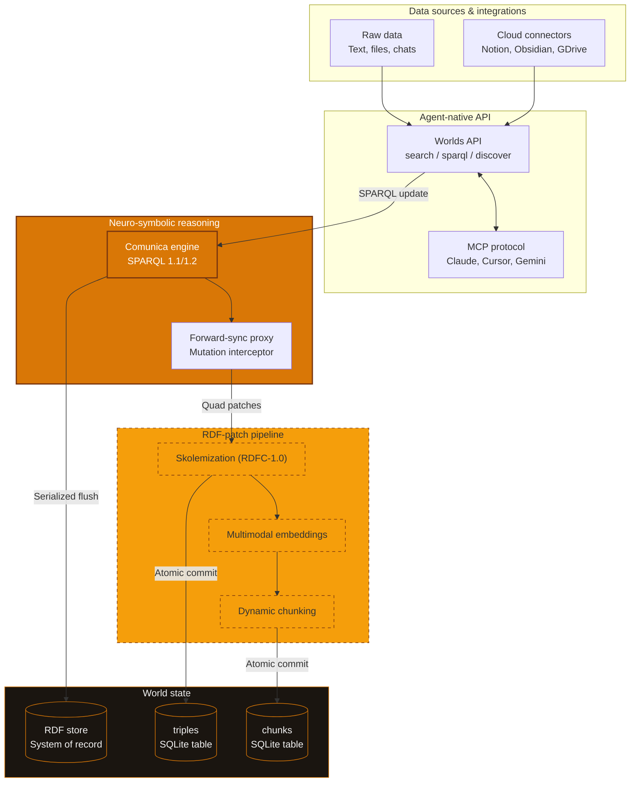
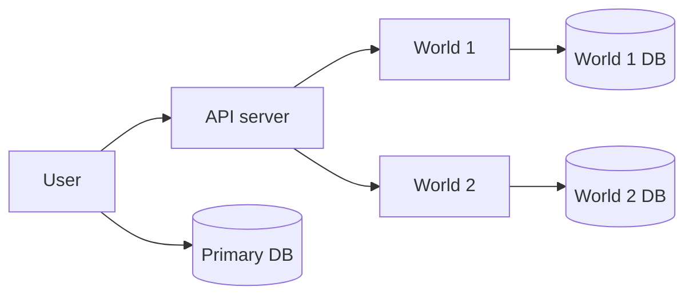
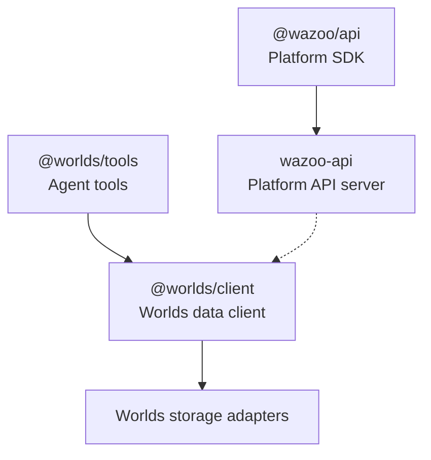

Wazoo separates platform management from graph data operations. The
public-facing Platform API manages users, world metadata, tokens, usage, limits,
and billing state. The Worlds Data API handles graph operations such as RDF
import, RDF export, search, and SPARQL.

## The connection model

The connection model uses composable components to scale system complexity:

- Client: Use the `@worlds/client` or standard HTTP requests inside an agent
  like Claude, Gemini, or a custom script to connect to the Worlds API.
- Memory: A World is an isolated sandbox for agent memories. You must target a
  specific World using a world token and the World ID for every request.
- Platform management: Use the [Platform API](/platform/api) or `@wazoo/api` to
  manage world metadata, platform tokens, world auth tokens, and usage records.
- Billing and limits: Usage and limits use transparent resource accounting.
  Stripe is the source of truth for billing and subscription state.

<Info>
  Agents should use world tokens to read and write facts. Platform tokens should
  stay with management systems and trusted automation.
</Info>

## High-level overview

The diagram illustrates the relationship between the management layer, reasoning
engine, and isolated persistent state.

## Platform API vs. Worlds Data API

The platform splits operations into two primary layers:

<Columns>
  

### Wazoo Platform API

The Wazoo Platform API is the management layer. It stores platform metadata and
manages user-owned World records, tokens, usage, limits, and billing state.

  

  

### Worlds Data API

The Worlds Data API handles RDF graph management, [SPARQL](/worlds/query)
execution, and [hybrid search](/worlds/search). This is the API layer where your
information lives.

  

</Columns>

## Provisioning status

The platform management layer is implemented as a Cloudflare Workers API using
Hono and Turso/libSQL for metadata. It currently records users, Worlds, tokens,
usage, and limits. The full production provisioning flow between platform
metadata and data-plane services is still evolving.

The control database keeps public World IDs separate from internal support
identities. Public resource names are computed from public IDs and never from
internal UIDs.

The public contract distinguishes platform metadata from verified data-plane
infrastructure: a World can exist in platform metadata while its provisioning
status is pending, active, failed, or deleted. The Platform API provisions one
Turso/libSQL database per World and `:sync` reconciles the deterministic
database and schema metadata.

Management-plane operations also feed the usage ledger. World creation,
provisioning, and sync record count metrics so quota/accounting reports include
hosted control-plane resource allocation, not only future data-plane traffic.

Billing is part of that production flow. Stripe owns subscription and billing
state; Wazoo should mirror only the entitlement state required to enforce
limits.

<Note>
  Treat this page as the current architectural shape, not a guarantee that every
  deployment mode is publicly available today.
</Note>

## Worlds API deep dive

<Accordion title="API data flow">
  The World Engine transforms raw data inputs into a neuro-symbolic knowledge state.

</Accordion>

## Storage engine

The platform uses a hybrid storage strategy to combine vector search with graph
logic.

### Hot memory

The platform utilizes a WASM-compiled RDF store that runs entirely within the
JavaScript runtime. This maintains an in-memory state in the edge cache between
requests to reduce read latency.

### Persistence and indexing

Persistence utilizes an edge-distributed database to maintain semantic
integrity. The system relies on a multi-index strategy:

- Graph indexing: Stores structural data records as an append-only chronological
  ledger. This enables rapid pattern matching.
- Vector indexing: Stores high-dimensional embeddings for text segments. This
  enables semantic similarity search at the edge.
- Full-text indexing: Provides exact keyword matching and ranking.

When executing a search, the engine utilizes Reciprocal Rank Fusion (RRF) to
combine results from the vector index and full-text index into a single, unified
relevance ranking. Structural graph constraints further restrict these results.

## Resource hierarchy

Users own Worlds directly in the private beta. The Worlds Data API treats the
user ID as an internal namespace so data-plane storage stays isolated without
exposing namespace management in the public product model.

### Worlds

Each World is a specific context or knowledge graph managed by the server.

- Dedicated storage: Each World maintains its own secondary SQLite database for
  [triples](/worlds#facts), chunks, and embeddings.
- Isolation: Access Worlds by public World ID or canonical resource name to
  ensure zero cross-contamination between contexts.

## Runtime status

Wazoo uses TypeScript across the current public clients and platform management
surface. The current Platform API server runs on Cloudflare Workers with Hono
and Turso/libSQL metadata. Worlds data-plane packages are published separately
and may target different JavaScript runtimes depending on the adapter.

## Repository topology

The ecosystem is split across focused repositories. The important boundary is
between platform management packages and Worlds data-plane packages.

The current Platform API server is organized by management resource:

- Worlds metadata.
- Platform tokens.
- World auth tokens.
- Usage records.

## Request flow

Platform requests authenticate with `wzp_` tokens and operate on management
metadata. Data-plane requests should authenticate with `wzw_` world tokens and
operate on graph data.

## Semantic data model

Worlds utilizes a standardized core ontology to provide agents with a
predictable set of primitives for reasoning, alignment, and discovery.

### Core classes

<ResponseField name="worlds:World" type="Class">
  The root container for a stateful knowledge graph sandbox.
</ResponseField>

<ResponseField name="worlds:Item" type="Class">
  A unique semantic entity defined by an IRI.
</ResponseField>

<ResponseField name="worlds:Fact" type="Class">
  A verified triple recorded in the chronological ledger.
</ResponseField>

<ResponseField name="worlds:Agent" type="Class">
  An entity with agency, such as an AI model or a human user.
</ResponseField>

<ResponseField name="worlds:Preference" type="Class">
  A recorded value alignment or reward signal.
</ResponseField>

### Core properties

<ResponseField name="worlds:hasFact" type="Property">
  Connects an Item or World to a Fact.
</ResponseField>

<ResponseField name="worlds:hasPreference" type="Property">
  Links a Fact to a human or autonomous preference signal.
</ResponseField>

<ResponseField name="worlds:hasReward" type="Property">
  A numerical reward score (0.0 to 1.0) representing an alignment signal.
</ResponseField>

<ResponseField name="worlds:verifiedBy" type="Property">
  Links a Fact to the Agent that verified it.
</ResponseField>

## Reification strategy

To enable high-stakes agency, Worlds uses reification, the process of making an
assertion (a triple) a first-class item. This allows agents to treat a specific
fact as an entity with its own metadata.

### How it works

<Steps>

  <Step title="The raw assertion">
    Consider the flat relationship:
    `@prefix user: <https://etok.me/#> . @prefix worlds: <https://schema.wazoo.dev#> . user:person worlds:uses <https://wazoo.dev/#worlds> .`
  </Step>
  <Step title="Creation of the fact entity">
    Worlds creates a `worlds:Fact` item to represent this unique statement.
  </Step>
  <Step title="Attachment of metadata">
    Metadata (provenance, rewards, timestamps) is attached to the fact entity
    rather than the raw relationship.
  </Step>
</Steps>

<Card title="Strategic value" icon="sparkles">
  Reification is the foundation of the recursive quality loop. By treating facts
  as items, agents can query reasoning paths, filter by trusted verifiers, and
  tune their models based on historical reward signals.
</Card>

## Alignment & intentional agency

RLHF transforms Worlds from a statistical mimicry engine into a system of
intentional agency. This creates a recursive quality loop where the system
optimizes its ontology and probability landscape to align with humans.

### Probability reshaping

Reinforcement Learning from Human Feedback (RLHF) acts as a series of nudges in
the model's high-dimensional token space:

- Logit shift: Increases raw scores for preferred paths and suppresses undesired
  ones.
- Softmax filter: Ensures that during inference, the model is statistically
  driven toward outcomes that align with the
  [recorded preferences](/worlds/update#feedback-ingestion).

As systems scale, human evaluation becomes a bottleneck. Worlds enables scalable
supervision (RLAIF) by using AI judges to evaluate candidate triples.

- Continuous evaluation: Scalable supervision is the operationalized form of an
  eval, allowing the system to scale its alignment without manual intervention.
- Constitutional AI (CAI): Alignment guided by a core set of principles (the
  ontology). Agents perform self-critique to ensure proposed triples do not
  violate constitutional rules.
- Collaborative oversight: Independent validator agents cross-verify knowledge.
  Every approval is a reified fact (`worlds:verifiedBy :agent_A`), creating an
  auditable log of the alignment process.

By leveraging the graph as a feedback mechanism, agents can grow a dataset from
scratch. This process is known as reinforcement learning from knowledge graph
feedback (RLKGF).

1.  Competency questions: The agent identifies gaps in the current graph.
2.  Self-correcting ontologies: The agent proposes and tests new classes for
    logical consistency using SPARQL ASK queries.
3.  Reward signal: If the structure maintains logic and answers the competency
    questions, it receives a higher reward.

### Academic grounding

This recursive approach to alignment is supported by major AI research:

- Recursive reward modeling (RRM): Jan Leike et al. (OpenAI) argue in "Scalable
  agent alignment via reward modeling" (https://arxiv.org/abs/1811.07871) that
  breaking complex evaluations into recursive sub-tasks is key to scaling
  oversight.
- Constitutional AI (CAI): The framework pioneered by Anthropic for aligning
  models via self-critique and principle-based "Constitutions."
- Recursive self-improvement (RSI): The theoretical basis for systems found in
  the work of Nick Bostrom and Eliezer Yudkowsky.

## Design principles

### Polymorphic resource managers

A design goal is to keep storage and deployment choices swappable without
changing the public API shape. The exact production matrix is still evolving.

| Resource             | Current direction                                                 |
| :------------------- | :---------------------------------------------------------------- |
| Platform API compute | Cloudflare Workers                                                |
| Platform metadata    | Turso/libSQL                                                      |
| Worlds data storage  | Adapter-specific SQLite-compatible storage                        |
| Private deployment   | Docker Compose, private networking, and tunnels where appropriate |

Do not assume every deployment mode is public or fully documented yet.

The Worlds API integrates symbolic precision with the statistical power of large
language models. By reifying facts and aligning state through human feedback,
the platform provides a deterministic substrate for intentional agency in
high-stakes contexts.
