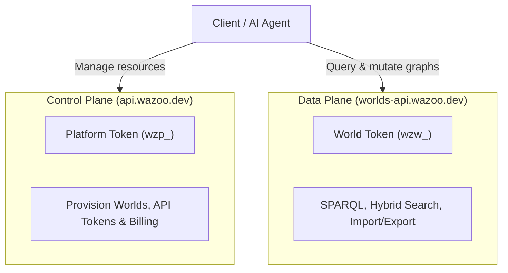

The Wazoo architecture separates management operations from graph data
operations:



## Authentication

Platform API requests use platform tokens with the `wzp_` prefix:

```http
Authorization: Bearer wzp_...
```

Platform tokens manage resources. World auth tokens use the `wzw_` prefix and
are intended for data-plane access to specific worlds.

## Base URL

```text
https://api.wazoo.dev/v1/
```

For local development of the Platform API server, use the Wrangler dev URL for
your Worker.

## Resources

The Platform API covers these management resources:

| Resource          | Routes                                                                  |
| ----------------- | ----------------------------------------------------------------------- |
| Worlds            | `/v1/worlds`, `/v1/worlds/:worldId`                                     |
| Platform tokens   | `/v1/auth/api-tokens`                                                   |
| World auth tokens | `/v1/worlds/:worldId/auth/tokens`                                       |
| Usage             | `/v1/worlds/:worldId/usage`                                             |
| Limits            | `/v1/worlds/:worldId/limits`                                            |
| Billing           | `/v1/worlds/:worldId/billing`, `/v1/worlds/:worldId/billing/openPortal` |
| Users             | `/v1/users/me`                                                          |
| Stripe webhook    | `/v1/stripe/webhook`                                                    |

Public `worldId` values must match `^[a-z][a-z0-9-]{2,62}$`. Internal `uid`
values use prefixes such as `w_...` so they cannot be confused with public path
IDs.

## Data-plane boundary

The Platform API does not execute SPARQL, search triples, import RDF, or export
RDF. Those operations belong to the Worlds Data API and `@worlds/client`.

## Related

- [TypeScript SDK](/platform/typescript-sdk) — typed client for the Platform API.
- [Worlds CLI](/reference/cli/worlds) — command-line management of worlds.
- [Console tokens](/console/tokens) — create and revoke platform tokens.
- [OpenAPI spec](https://api.wazoo.dev/openapi.json) — live API reference.
