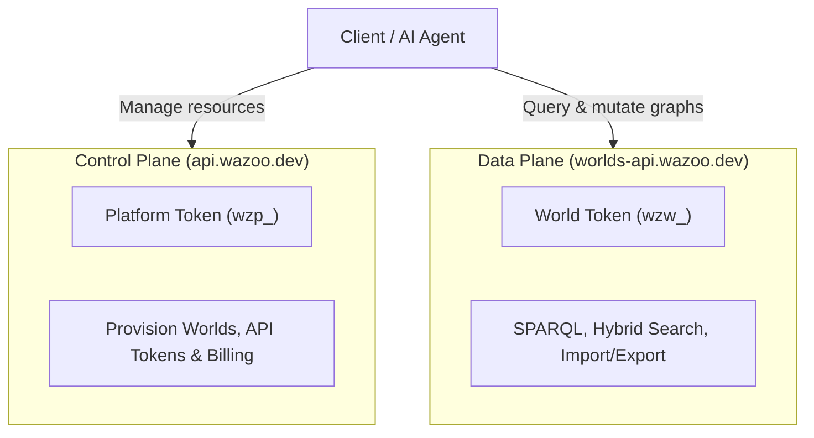

The Wazoo architecture separates management operations from graph data
operations:



## Authentication

Platform API requests use platform tokens with the `wzp_` prefix.

```http
Authorization: Bearer wzp_...
```

Platform tokens can manage resources. They are not the same as world auth
tokens. World auth tokens use the `wzw_` prefix and are intended for data-plane
access to specific worlds.

## Base URL

```text
https://api.wazoo.dev/v1/
```

For local development of the Platform API server, use the Wrangler dev URL for
your Worker.

## Resources

The Platform API covers these management resources:

| Resource          | Routes                                                                  |
| ----------------- | ----------------------------------------------------------------------- |
| Worlds            | `/v1/worlds`, `/v1/worlds/:worldId`                                     |
| Platform tokens   | `/v1/auth/api-tokens`                                                   |
| World auth tokens | `/v1/worlds/:worldId/auth/tokens`                                       |
| Usage             | `/v1/worlds/:worldId/usage`                                             |
| Limits            | `/v1/worlds/:worldId/limits`                                            |
| Billing           | `/v1/worlds/:worldId/billing`, `/v1/worlds/:worldId/billing/openPortal` |
| Users             | `/v1/users/me`                                                          |
| Stripe webhook    | `/v1/stripe/webhook`                                                    |

Public `worldId` values must match:

```text
^[a-z][a-z0-9-]{2,62}$
```

Internal `uid` values intentionally use prefixes such as `w_...` so they cannot
be confused with public path IDs.

World deletes are soft-retained. Delete records internal retention state; list
endpoints exclude deleted resources by default, while direct get can return
retained deleted resources until purge.

World lifecycle routes include:

```http
DELETE /v1/worlds/:worldId
POST /v1/worlds/:worldId/undelete
POST /v1/worlds/:worldId/sync
```

World delete revokes world auth tokens. World undelete runs reconciliation
before reactivating the World and does not restore revoked tokens.

## Data-plane boundary

The Platform API does not execute SPARQL, search triples, import RDF, or export
RDF. Those operations belong to the Worlds Data API and `@worlds/client`.

The intended production boundary is:

- Wazoo Console runs at `console.wazoo.dev` for human beta application and
  management flows.
- Wazoo Platform API runs at `api.wazoo.dev` for management/control-plane calls.
- Worlds Data API runs at `worlds-api.wazoo.dev` for
  graph/search/SPARQL/import/export.
- `wzp_` platform tokens manage users, Worlds, tokens, and usage.
- `wzw_` world tokens authorize world data access.
- Data-plane services can integrate with platform usage and limits.

## Users and beta access

The [Console](/console/overview) at `console.wazoo.dev` provides a human
interface for viewing and managing Worlds. Access is gated by Cloudflare Access
with email OTP.

Users on the [beta allowlist](/platform/private-beta) can sign in to the
Console. The `GET /v1/users/me?email=...` endpoint returns the current user or
creates one on first access.

## Usage and limits

The Platform API records integer resource usage for world operations. If a
configured limit would be exceeded, it returns `RESOURCE_EXHAUSTED` with a quota
object.

Effective quota states are:

```text
OK
WARN
THROTTLED
SUSPENDED
MANUAL_REVIEW
```

Under `THROTTLED` or `SUSPENDED`, management gates block world creation and
token creation; revoking tokens stays allowed.

During private beta, usage is recorded for accounting and entitlement evaluation
only. No credits are deducted and no payment enforcement occurs.

## Provisioning

New Worlds are provisioned as one Turso/libSQL database per World.
`POST /v1/worlds/:worldId/sync` verifies the deterministic database exists and
re-initializes the schema and identity metadata when needed, returning a
`syncReport` with status `HEALTHY`, `REPAIRED`, `BLOCKED`, or `FAILED`.

## Billing

Stripe is the source of truth for billing and subscription state; the API
mirrors only the entitlement data needed for product behavior. Current beta
routes expose Stripe-shaped state without payment enforcement:

```http
GET /v1/worlds/:worldId/billing
POST /v1/worlds/:worldId/billing/openPortal
POST /v1/stripe/webhook
```

Most private beta Worlds return `state = "BETA_FREE"` and
`paymentRequired = false`.

## Admin tokens and audit

Global admin platform tokens are manually seeded with the `admin` scope; public
token creation endpoints cannot mint them. Admin-only actions write internal
audit events; there is no public audit API in v1.

## World token rotation

World auth token rotation is an atomic revoke-and-replace operation. Under
`THROTTLED`, rotation is allowed only when it revokes existing World tokens and
returns one replacement without expanding access duration or count.

## SDKs and spec

For typed clients, see the [TypeScript SDK](/platform/typescript-sdk). The live
OpenAPI specification is available at `https://api.wazoo.dev/openapi.json`.
