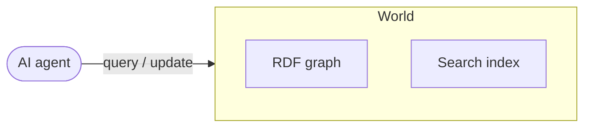
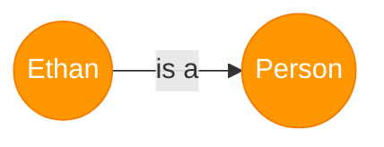
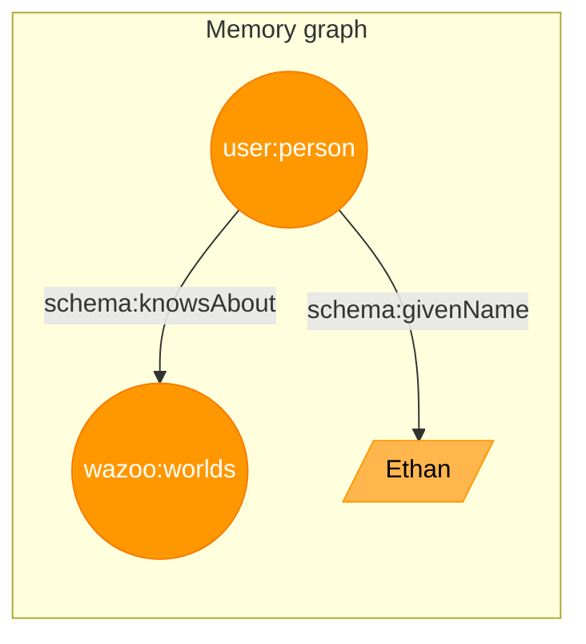

A world is a stateful knowledge graph engine that functions as an agent's
verifiable context.

Worlds works best when memory is curated, not accumulated. See
[Memory appraisal](/worlds/memory-appraisal) for how to decide what belongs in a
world, what belongs in another source system, and what should be discarded after
the durable record exists.

<div align="center">



</div>

A world is made of items made of facts.

## Items

Worlds represent everything as an item, including the types themselves. This
recursive structure enables granular, multi-hop reasoning.

An item is...

- Assigned a unique
  [IRI](https://en.wikipedia.org/wiki/Internationalized_Resource_Identifier).
- Defined by one or more facts.
- Any "thing" in your world, including documents, people, physical objects, and
  abstract concepts.

## Properties

Properties connect items. They define actions or attributes, such as `worksFor`
or `givenName`. The set of valid properties forms the graph's vocabulary,
enabling agents to navigate and mutate state with precision.

## Facts

A fact is a unit of data expressed as a structured statement that connects two
items using a property. Every fact is inherently bound to the dimension of time.
Worlds maintains an append-only, chronological ledger of facts, allowing agents
to understand exactly how state and information evolve.

Conceptually, a fact functions exactly like a structured assertion. For example,
the assertion "Ethan is a person" can be represented as:

<div align="center">



</div>

## Triples

Computers store facts in a data structure called the triple, which is built from
three components called terms.

### Anatomy

<Frame caption="Analogy between triples and molecules">


</Frame>

<ResponseField name="Subject" type="Term">
  The item you are describing e.g., `user:person`
</ResponseField>

<ResponseField name="Predicate" type="Term">
  The structural representation of a property e.g., `rdf:type`
</ResponseField>

<ResponseField name="Object" type="Term">
  Another item or a raw data value e.g., `schema:Person`
</ResponseField>

### Topography

The Object of a triple determines how the graph grows. Facts branch into two
types:

- Item-to-item: Connects two distinct items e.g., `user:person` ->
  `schema:knowsAbout` -> `wazoo:worlds`
- Item-to-value: Connects an item to a raw data value, adding searchable detail
  but acting as a terminal point e.g., `user:person` -> `schema:givenName` ->
  `"Ethan"`

<div align="center">



</div>

### Serialization

To codify knowledge, Worlds standard RDF serialization formats for expressing
triples in plain text.

To assert "Ethan is a Person", the syntax goes:

<CodeGroup>

```turtle Turtle
@prefix user: <https://etok.me/#> .
@prefix schema: <https://schema.org/> .

user:person a schema:Person .
```

```json JSON-LD
{
  "@context": {
    "user": "https://etok.me/#",
    "schema": "https://schema.org/"
  },
  "@id": "user:person",
  "@type": "schema:Person"
}
```

```turtle N-Triples
<https://etok.me/#person> <http://www.w3.org/1999/02/22-rdf-syntax-ns#type> <https://schema.org/Person> .
```

```html Microdata
<div
  itemscope
  itemid="https://etok.me/#person"
  itemtype="https://schema.org/Person"
>
  <!-- Additional facts go here -->
</div>
```

</CodeGroup>

Items can consolidate multiple facts into a single structure. Here, we assert
that Ethan is a person with the given name "Ethan":

<CodeGroup>

```turtle Turtle
@prefix user: <https://etok.me/#> .
@prefix schema: <https://schema.org/> .

user:person a schema:Person ;
  schema:givenName "Ethan" .
```

```json JSON-LD
{
  "@context": {
    "user": "https://etok.me/#",
    "schema": "https://schema.org/"
  },
  "@id": "user:person",
  "@type": "schema:Person",
  "schema:givenName": "Ethan"
}
```

```turtle N-Triples
<https://etok.me/#person> <http://www.w3.org/1999/02/22-rdf-syntax-ns#type> <https://schema.org/Person> .
<https://etok.me/#person> <https://schema.org/givenName> "Ethan" .
```

```html Microdata
<div
  itemscope
  itemid="https://etok.me/#person"
  itemtype="https://schema.org/Person"
>
  <span itemprop="https://schema.org/givenName">Ethan</span>
</div>
```

</CodeGroup>

## Verification

To verify a fact, Worlds uses the SPARQL ASK query. This provides a
deterministic boolean answer without probabilistic guessing.

For example, to verify if "Ethan knows about Worlds", use:

```sparql SPARQL
PREFIX wazoo: <https://wazoo.dev/#>

ASK WHERE {
  <https://etok.me/#person> wazoo:knowsAbout <https://wazoo.dev/#worlds> .
}
```

In the API, use the `sparql` method to perform this check:

```typescript TypeScript
// worlds.sparql accepts the public world ID.
const result = await worlds.sparql(
  "my-world",
  "PREFIX wazoo: <https://wazoo.dev/#> ASK WHERE { <https://etok.me/#person> wazoo:knowsAbout wazoo:worlds . }",
);

if (result.boolean) {
  // Fact is verified
}
```

## Why care?

Worlds is built on standard knowledge representation formats. This provides
autonomous agents with an established, interoperable foundation for reasoning.
