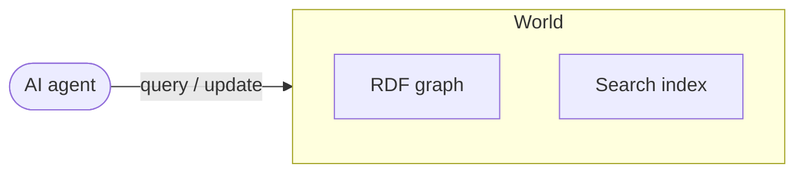
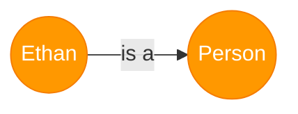
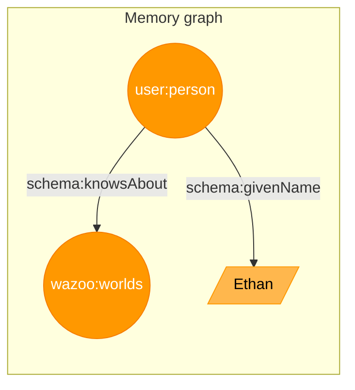

A [world](/glossary#world) is a stateful, synchronizable dataset that acts as an
agent's verifiable context. Worlds' default engine models worlds as knowledge
graphs, but the world contract is data-model agnostic: a world can also be
backed by a relational database or another syncable store.

Worlds works best when memory is curated, not accumulated. Store durable facts
in a world and discard the rest.

<div align="center">


```mermaid
graph LR
    Agent([AI agent]) -->|query / update| W[(World)]
    subgraph W [World]
        direction TB
        RDF[RDF graph]
        SEARCH[Search index]
    end
```

</div>

A world is made of items made of facts.

## Items

Worlds represents everything as an item, including the types themselves. This
recursive structure enables granular, multi-hop reasoning.

An item is...

- Assigned a unique
  [IRI](https://en.wikipedia.org/wiki/Internationalized_Resource_Identifier).
- Defined by one or more facts.
- Any "thing" in your world, including documents, people, physical objects, and
  abstract concepts.

## Properties

Properties connect items. They define actions or attributes, such as `worksFor`
or `givenName`. The set of valid properties forms the graph's vocabulary. Agents
use these properties to navigate and mutate state precisely.

## Facts

A fact is a unit of data expressed as a structured statement that connects two
items using a property. Every fact is tied to a moment in time. Worlds keeps an
append-only, chronological ledger of facts, so agents can trace exactly how
state and information change.

Conceptually, a fact is a structured assertion. For example, you can represent
the assertion "Ethan is a person" as:

<div align="center">


```mermaid
graph LR
    A((Ethan)) -->|is a| B((Person))
    style A fill:#FF9800,stroke:#F57C00,color:#fff
    style B fill:#FF9800,stroke:#F57C00,color:#fff
```

</div>

## Triples

Computers store facts in a data structure called the triple, which is built from
three components called terms.

### Anatomy

<Frame caption="Analogy between triples and molecules">


</Frame>

<ResponseField name="Subject" type="Term">
  The item you are describing e.g., `user:person`
</ResponseField>

<ResponseField name="Predicate" type="Term">
  The structural representation of a property e.g., `rdf:type`
</ResponseField>

<ResponseField name="Object" type="Term">
  Another item or a raw data value e.g., `schema:Person`
</ResponseField>

### Topography

The Object of a triple determines how the graph grows. Facts branch into two
types:

- Item-to-item: Connects two distinct items e.g., `user:person` ->
  `schema:knowsAbout` -> `wazoo:worlds`
- Item-to-value: Connects an item to a raw data value that is searchable but
  terminates the branch e.g., `user:person` -> `schema:givenName` -> `"Ethan"`

<div align="center">


```mermaid
graph LR
    subgraph "Memory graph"
    A((user:person)) -->|schema:knowsAbout| B((wazoo:worlds))
    A -->|schema:givenName| C[/"Ethan"/]
    end
    style A fill:#FF9800,stroke:#F57C00,color:#fff
    style B fill:#FF9800,stroke:#F57C00,color:#fff
    style C fill:#FFB74D,stroke:#FF9800,color:#000
```

</div>

### Serialization

Worlds uses standard RDF serialization formats to express triples in plain text.
For how to load serialized data into a world, see [Update](/worlds/update).

To assert "Ethan is a Person", use:

<CodeGroup>

```turtle Turtle
@prefix user: <https://etok.me/#> .
@prefix schema: <https://schema.org/> .

user:person a schema:Person .
```

```json JSON-LD
{
  "@context": {
    "user": "https://etok.me/#",
    "schema": "https://schema.org/"
  },
  "@id": "user:person",
  "@type": "schema:Person"
}
```

```turtle N-Triples
<https://etok.me/#person> <http://www.w3.org/1999/02/22-rdf-syntax-ns#type> <https://schema.org/Person> .
```

```html Microdata
<div
  itemscope
  itemid="https://etok.me/#person"
  itemtype="https://schema.org/Person"
>
  <!-- Additional facts go here -->
</div>
```

</CodeGroup>

Items can consolidate multiple facts into a single structure. This example
asserts that Ethan is a person with the given name "Ethan":

<CodeGroup>

```turtle Turtle
@prefix user: <https://etok.me/#> .
@prefix schema: <https://schema.org/> .

user:person a schema:Person ;
  schema:givenName "Ethan" .
```

```json JSON-LD
{
  "@context": {
    "user": "https://etok.me/#",
    "schema": "https://schema.org/"
  },
  "@id": "user:person",
  "@type": "schema:Person",
  "schema:givenName": "Ethan"
}
```

```turtle N-Triples
<https://etok.me/#person> <http://www.w3.org/1999/02/22-rdf-syntax-ns#type> <https://schema.org/Person> .
<https://etok.me/#person> <https://schema.org/givenName> "Ethan" .
```

```html Microdata
<div
  itemscope
  itemid="https://etok.me/#person"
  itemtype="https://schema.org/Person"
>
  <span itemprop="https://schema.org/givenName">Ethan</span>
</div>
```

</CodeGroup>

## Verification

To verify a fact, Worlds runs a graph pattern query (SPARQL ASK). This returns a
deterministic boolean answer and does not rely on probabilistic guessing. See
[Query](/worlds/query) for how graph pattern queries work with Worlds.

For example, to verify if "Ethan knows about Worlds", use:

```sparql SPARQL
PREFIX wazoo: <https://wazoo.dev/#>

ASK WHERE {
  <https://etok.me/#person> wazoo:knowsAbout <https://wazoo.dev/#worlds> .
}
```

In the API, use the data-plane SPARQL endpoint with a `wzw_` world token:

```bash
curl -s -X POST "https://data.wazoo.dev/worlds/my-world/sparql" \
  -H "Authorization: Bearer $WORLDS_TOKEN" \
  -H "Content-Type: application/json" \
  -d '{
    "query": "PREFIX wazoo: <https://wazoo.dev/#> ASK WHERE { <https://etok.me/#person> wazoo:knowsAbout wazoo:worlds . }"
  }'
```

The response returns `boolean: true` when the fact is verified.

## Why care?

Worlds is built on standard knowledge representation formats. This gives
autonomous agents an interoperable foundation for reasoning.

## Next steps

- [Search](/worlds/search): hybrid retrieval over a world
