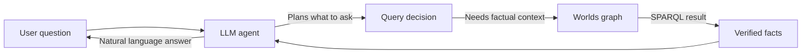
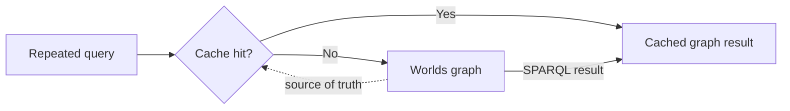

After [hybrid search](/worlds/search) disambiguates a starting item, agents
traverse its connected facts using SPARQL (SPARQL Protocol and RDF Query
Language). This is the W3C standard for knowledge graphs.

## SPARQL reasoning

SPARQL matches patterns against facts, follows relationships, and returns exact
results without probabilistic guessing.

### Symbolic logic

Given triples such as `user:person wazoo:worksFor wazoo:organization`, query for
the organization:

```typescript TypeScript
import { Worlds } from "@worlds/client";

const worlds = new Worlds({
  apiKey: process.env.WORLDS_TOKEN,
});

// Execute a SPARQL query to retrieve facts
const response = await worlds.sparql(
  "my-world-id",
  `PREFIX wazoo: <https://wazoo.dev/#>

  SELECT ?wazoo WHERE {
    <https://etok.me/#person> wazoo:worksFor ?wazoo .
  }`,
);
```

### Neuro-symbolic reasoning

Worlds fuses semantic discovery with symbolic logic. Hybrid search disambiguates
the natural language intent into a specific starting item, while SPARQL executes
the deterministic traversal across verified facts.

| Context   | Hybrid search       | SPARQL                  |
| :-------- | :------------------ | :---------------------- |
| Dimension | Semantic discovery  | Deterministic reasoning |
| Goal      | Item disambiguation | Factual traversal       |
| Logic     | Probabilistic       | Symbolic                |

The Worlds API provides an external source of truth that an agent can
deterministically verify. In practice, an LLM accesses this source of truth via
tool calling, allowing it to ground its responses in **verified facts** rather
than probabilistic weights.

## LLM inference vs. graph queries

LLM inference predicts the next token from model weights and prompt context.
That makes it useful for language, synthesis, and planning, but weak as a source
of truth.

SPARQL queries a graph of stored facts. When an agent asks Worlds a question,
the model can use a tool call to retrieve facts instead of relying only on
probabilistic generation.

| Layer         | What it does                          | Failure mode                                                  |
| ------------- | ------------------------------------- | ------------------------------------------------------------- |
| LLM inference | Predicts useful language from context | Returns plausible but incorrect facts when context is missing |
| SPARQL query  | Matches patterns against stored facts | Returns only what the graph can answer                        |

In practice, the LLM decides what to ask. Worlds answers from the graph. The
final response can still be natural language, but the facts come from a
deterministic query path.

## Operational tradeoff

Graph grounding changes where the system spends resources. Instead of paying the
model to reconstruct facts from long prompts on every answer, you store and
index facts once, then retrieve them through short queries.



| Path        | Token cost | Latency     | Space cost | Freshness risk   | Best for                |
| ----------- | ---------- | ----------- | ---------- | ---------------- | ----------------------- |
| LLM-only    | High       | Model-bound | Low        | Prompt-dependent | Language and synthesis  |
| Graph query | Low        | Query-bound | Medium     | Low              | Verified factual lookup |

This tradeoff is deliberate. The system uses storage and indexes to reduce
repeated inference cost while preserving an inspectable path back to the source
facts.

## Caching hot reads

After facts move into a graph, caching can optimize repeated reads. A cache
stores derived query results or materialized views for hot paths, while the
graph remains the authoritative state.



| Path                | Token cost | Latency     | Space cost | Freshness risk                | Best for                   |
| ------------------- | ---------- | ----------- | ---------- | ----------------------------- | -------------------------- |
| Graph query         | Low        | Query-bound | Medium     | Low                           | Verified factual lookup    |
| Cached graph result | Lowest     | Low on hits | Higher     | Depends on cache invalidation | Hot repeated factual reads |

---

## High-stakes context

Standard RAG struggles with evolving facts and complex relational queries.
Worlds maintains a living knowledge graph where contradictions are resolved at
the data layer.

### The evolving fact

Consider a scenario where information changes rapidly:

1. Monday: "I am working on Project Apollo."
2. Wednesday: "I am pausing Apollo to focus on Project Hermes."
3. Friday: "What am I working on?"

Traditional RAG retrieves both contradictory chunks, forcing the LLM to guess.
Worlds updates the specific graph relationship, ensuring the agent only
retrieves the current state.

### Grounding agents in ontologies

By using `discover-schema`, agents retrieve the world's ontology before
attempting to query it.

1.  Discovery: Agent retrieves the world's ontology.
2.  Mapping: Agent maps intent to specific RDF classes and predicates.
3.  Querying: Agent executes precise SPARQL queries instead of depending solely
    on vector similarity.

## Preference-aware retrieval

While standard SPARQL is strictly deterministic, retrieval can be further
aligned with human intent through feedback.

When a query results in multiple valid paths, the engine uses the reshaped
probability landscape to prefer the path that has historically yielded
high-reward results.

This transformation moves the system from deterministic reasoning to intentional
agency. Learn more about the theory in the
[Architecture](/contribute/architecture#alignment--intentional-agency)
deep-dive.
